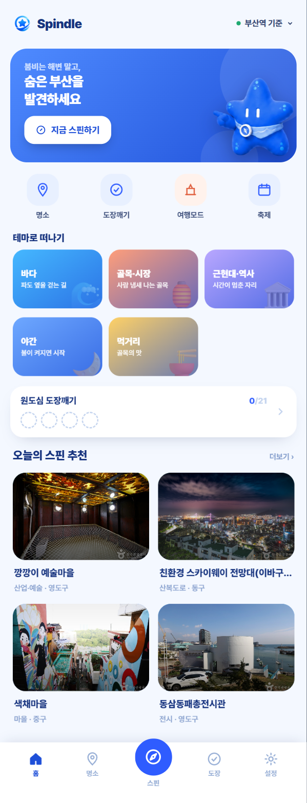
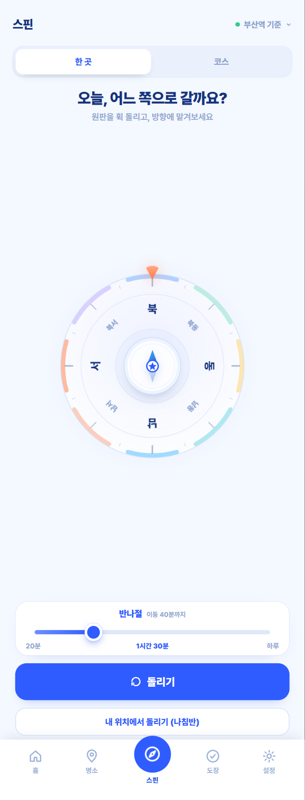
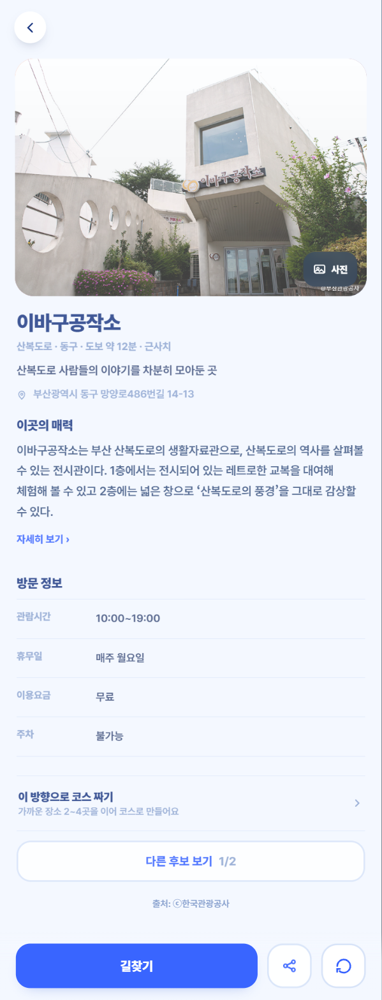
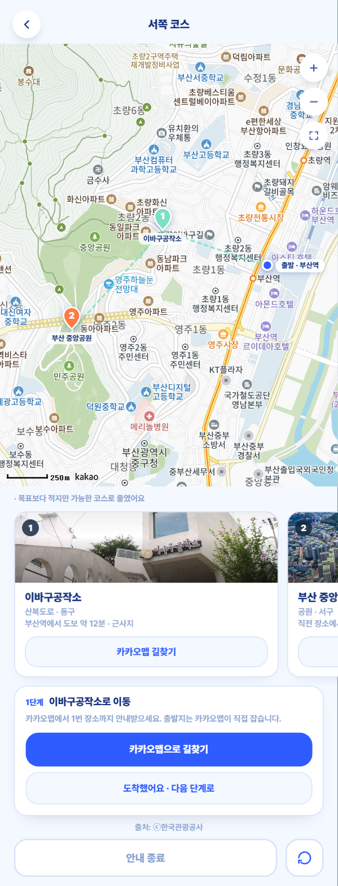
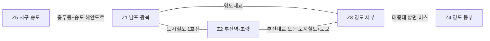
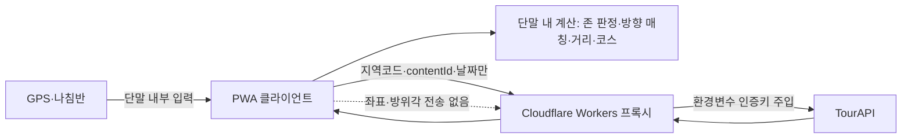

# Spindle

**휴대폰을 돌려, 가리킨 방향의 부산을 만나는 관광 분산형 탐색 PWA**

> 2026 관광데이터 활용 공모전 · 웹·앱 개발 부문 출품작
> 부산 중구 · 동구 · 서구 · 영도구 | 1인 개발(이진우)

### ▶ 지금 바로 실행 — **https://spindle-6vp.pages.dev**

설치·로그인·앱스토어 없이 모바일·데스크톱 브라우저에서 바로 열립니다.
**부산에 계시지 않아도 모든 기능이 동작합니다** — 아래 "3분 시연 경로"를 따라가 주세요.

---

## 30초 요약

부산 관광의 기억은 소수 대표지에 쏠려 있습니다. 2021년 부산 방문객 조사에서 "가장 기억에 남는 지역"은 해운대해수욕장 58.4%, 광안리 31.7%로 나타났습니다.

Spindle은 이 쏠림을 **설득이 아니라 게임 구조로** 풉니다.

|  | |
|---|---|
| **무엇** | 휴대폰을 돌려 정한 8방위 안에서 관광지 한 곳 또는 2~4곳 코스를 추천 |
| **왜 방향인가** | 늘 가던 쪽이 아닌 방위가 뽑히면, 계몽 없이도 동선이 흩어짐 |
| **무엇이 다른가** | 무작위가 아님 — 접근 가능성·운영 상태·인지도 역가중을 통과한 후보만 뽑힘 |
| **어떤 데이터** | 한국관광공사 TourAPI **2개 서비스** 실시간 호출 (관광정보 + 관광지 집중률 예측) |
| **원칙** | **GPS 좌표·방위각을 어떤 서버로도 보내지 않음** — 위치 계산 전부 단말 내 수행 |

---

## 화면

| 홈 | 스핀 | 결과 카드 | 코스 안내 |
|---|---|---|---|
|  |  |  |  |
| 실시간 TourAPI 추천과 테마 덱 | 원판을 돌리거나 나침반으로 겨냥 | 이용시간·휴무·요금까지 실데이터 | 순번 핀 + 2단계 길찾기 위임 |

## 3분 시연 경로 (심사용)

부산 밖에서도 그대로 재현됩니다. 센서 권한이 필요 없습니다.

1. **https://spindle-6vp.pages.dev** 접속 → 온보딩 통과
2. **스핀** 탭 → 상단 `남포동 기준` 확인 (부산 밖이면 여행 모드가 기본)
3. 이동시간 다이얼을 **60분** 정도로 조절
4. 원판을 손가락으로 **휙 돌리거나** `돌리기` 버튼 → 방위 확정 연출 → 결과 카드
5. 결과 카드에서 사진·소개·이용시간·휴무·길찾기 확인 → `공유 카드 만들기`
6. 뒤로 → 스핀 상단 **`코스`** 모드 선택 → `코스 돌리기` → **2~4곳 코스 지도**
7. 코스 화면 하단 `코스 안내 시작` → **1단계**(1번 장소 길찾기) → `도착했어요` → **2단계**(전체 코스)
8. **명소** 탭 → 지도에서 `오늘 혼잡 예상` / `오늘 가기 좋아요` 확인 (집중률 예측 API)

> 부산 현장에서는 스핀 화면 하단 `내 위치에서 돌리기 (나침반)`으로 **실제 휴대폰을 돌려** 방향을 겨눌 수 있습니다. 권한 거부·미지원·권역 밖이면 사유 한 줄과 함께 여행 모드로 이어집니다.

---

## 핵심 기능

| 기능 | 설명 |
|---|---|
| **방향 스핀** | 현장 모드는 실제 기기 방위, 여행 모드는 원판 스핀. 확정 각도가 그대로 알고리즘 입력 |
| **분산 추천** | 방향 일치도 × 접근 가능성 × 운영 상태 × 분산 가중치로 후보를 좁히고 가중 랜덤 선택 |
| **방향 기반 코스** | 같은 방위·이동시간 예산 안에서 2~4곳을 순서대로 연결 |
| **혼잡 예측 지도** | 집중률 예측 API로 당일 혼잡·쾌적 관광지를 지도에 표시 |
| **테마 덱** | 바다·골목시장·근현대·야간·먹거리 중 선택해 우연성에 취향을 더함 |
| **축제 특별 카드** | 오늘 열리는 행사가 스핀 방향과 맞을 때만 노출 |
| **부산 동네 도장깨기** | 방문 의사 행동으로 4개 구 수집 현황을 단말에 기록 (로그인 없음) |
| **공유 카드** | 1080×1920 PNG 생성·저장·공유 |

---

## 이 서비스의 두 가지 축

### 1. 부산의 지형이 알고리즘을 바꾼다 — 존-교량 모델

반경 검색은 바다 건너 직선거리도 "가깝다"고 판단합니다. Spindle은 대상지를 5개 생활권 존으로 나누고, 존을 건널 때 실제 교량·지하철·버스 경유 비용을 반영합니다.



같은 500m라도 영도대교를 건너느냐 산복도로를 오르느냐에 따라 이동시간이 달라지고, 그 차이가 추천 결과를 바꿉니다. **지역 필터가 아니라 재사용 가능한 지역 접근성 모델**이며, 존 다각형·연결 비용·인기도 티어 세 가지만 교체하면 다른 도시로 확장됩니다.

또한 35개 대표 POI를 인기도 T1~T3로 큐레이션해 **T3(숨은 명소)가 T1(대표 관광지)보다 3.2배 높은 분산 가중치**를 갖도록 설계했습니다. 티어는 계산에만 쓰고 화면에 배지로 노출하지 않습니다.

### 2. 좌표를 서버로 보내지 않는다



방향 매칭, 존 판정, 거리 계산, 코스 구성이 **전부 단말 안에서 끝납니다.** 프록시는 인증키 보호와 요청 중계만 하며 지역코드·contentId·날짜 같은 비개인 파라미터만 받습니다.

공모전 공식 FAQ 기준(*"단말기 내부에서만 활용하고 사업자 서버로 전송하지 않으면 위치기반서비스사업 신고 대상 제외"*)에 따라 **비신고 구조**에 해당합니다.

이건 선언이 아니라 **자동 검사로 강제**합니다 — 금지 패턴 스캐너(`locationBasedList2`, 클라이언트 내 인증키·좌표 파라미터)가 커밋마다 실행되고, 네트워크 URL에 좌표가 섞이지 않음을 단위 테스트로 고정합니다.

---

## TourAPI 활용

**국문 관광정보 서비스(KorService2)**

| 엔드포인트 | 용도 |
|---|---|
| `areaBasedList2` | 4개 구 관광 POI 목록 (좌표 기반 `locationBasedList2`는 의도적으로 미사용) |
| `detailCommon2` | 관광지명·주소·개요·대표 이미지 |
| `detailIntro2` | 이용시간·휴무·요금·주차 → 운영 상태 판단 |
| `detailImage2` | 대표 이미지가 부족한 장소의 추가 이미지 |
| `searchFestival2` | 축제·행사 → 조건부 특별 카드 |
| `areaCode2` | 지역코드 확인 |

**관광지 집중률 예측 서비스**

| 엔드포인트 | 용도 |
|---|---|
| `tatsCnctrRatedList` | 부산 4개 법정구역의 당일 예상 집중률 → 혼잡·쾌적 지도 표시 |

모든 호출은 **실시간**이며, 응답을 로컬 DB·파일·localStorage·IndexedDB·Cache Storage에 저장하지 않습니다. 세션 메모리에서만 재사용합니다.

---

## 규정 준수를 위해 덜어낸 것

기능을 더하는 것보다 **덜어낸 판단**이 이 서비스의 성격을 결정했습니다.

| 하지 않은 것 | 이유 |
|---|---|
| **앱 내 턴바이턴 내비게이션** | 경로를 받으려면 사용자 현재 좌표를 라우팅 API로 전송해야 함 → 좌표 무전송 원칙 위반 + 신고 대상 전환. **길찾기는 카카오맵에 위임**하고 앱은 단계 관리만 담당 |
| **`locationBasedList2`** | 좌표 전송이 필요. 지역코드로 후보를 받아 단말에서 방향·거리를 계산 |
| **사전 캐싱 자체 DB** | 실시간 호출만 인정하는 규정에 맞춰 전면 재설계. 성능은 세션 내 디듀프·프리페치로 보완 |
| **계정·로그인** | 수집하지 않은 정보는 유출될 수 없음 |

---

## 기술 구성

| 영역 | 내용 |
|---|---|
| 프론트엔드 | React + TypeScript (Vite), PWA (manifest + service worker) |
| 프록시 | Cloudflare Workers — 인증키 주입·요청 중계만, 로그 미저장 |
| 배포 | Cloudflare Pages |
| 지도 | 카카오맵 JS SDK + 자체 오버레이 핀, 실패 시 내장 벡터 지도 폴백 |
| 품질 게이트 | 금지 패턴 스캐너 + 타입체크 + 린트 + 단위 테스트를 **커밋마다 자동 실행** |

### 로컬 실행

```bash
npm install
npm run dev:proxy   # 프록시 (wrangler dev, :8787) — proxy/.dev.vars에 인증키
npm run dev         # 웹 (Vite) — /api는 로컬 프록시로 전달
npm run check       # 품질 게이트 전체 (guard + typecheck + lint + test)
```

인증키는 저장소에 포함돼 있지 않습니다. `proxy/.dev.vars.example`을 참고해 직접 설정해야 합니다.

---

## 문서

| 문서 | 내용 |
|---|---|
| [기능설명서](docs/submission/기능설명서.md) | **공모전 제출용 상세 설명서** — 알고리즘·데이터·아키텍처·발전성 전문 |
| [SPEC.md](SPEC.md) | 전체 기능 명세 |
| [docs/zones.md](docs/zones.md) | 존-교량 모델 원천 데이터 |
| [docs/curation.md](docs/curation.md) | POI 인기도 티어 큐레이션 표 |
| [docs/course.md](docs/course.md) | 방향 기반 코스 구성 규칙 |
| [docs/competition.md](docs/competition.md) | 공모전 규정·심사 배점·규정 판단 기록 |

---

출처: ⓒ한국관광공사

본 서비스는 한국관광공사 TourAPI를 활용해 개발한 개인 출품작이며, 한국관광공사가 직접 개발·운영하는 서비스가 아닙니다.
