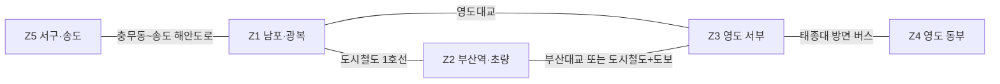
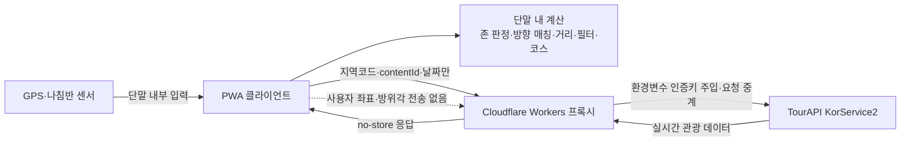

# Spindle 기능설명서 초안

> 2026 관광데이터 활용 공모전 웹·앱 개발 부문 제출용 초안  
> 작성 기준일: 2026-07-31  
> 제출 전 최종 화면 캡처, 실기기 검증 결과, 운영 URL을 반영해 편집한다.

## 심사 기준 대응 요약

| 심사 항목 | 배점 | Spindle의 대응 |
|---|---:|---|
| 기획력 | 30 | 대표 관광지 쏠림을 스핀 게임화와 분산 가중치로 해결하는 명확한 문제-해법 구조 |
| 완성도 | 30 | 센서가 필요한 현장 모드와 어디서나 재현 가능한 여행 모드, 실패 처리, 결과·공유·코스까지 이어지는 완결된 흐름 |
| 데이터 활용 적절성 | 20 | TourAPI KorService2를 핵심 동선에서 실시간 호출하고, 상세·이미지·운영·축제 데이터를 기능에 직접 반영 |
| 발전성 | 20 | 존-교량 모델의 타 지역 템플릿화와 RTO 협업형 관광 분산 지표 로드맵 |
| 지역특화 | +2 | 부산 중구·동구·서구·영도구의 지형·교량·생활권을 알고리즘 데이터로 모델링 |

## 1. 서비스 개요

Spindle은 여행 중 반복되는 “다음에 어디 가지?”라는 선택 피로를 휴대폰을 돌리는 스핀 경험으로 바꾸는 관광 분산형 게임 탐색 PWA다. 그러나 목적은 재미있는 룰렛을 하나 더 만드는 데 있지 않다. 해운대·광안리 같은 대표 관광지에 집중된 방문 수요를 부산 원도심과 영도의 골목, 시장, 근현대 문화유산으로 흘려보내는 것이 서비스의 핵심이다.

스핀은 사용자가 이동할 방향을 즐겁게 결정하게 하고, 추천 엔진은 그 방향 안에서 실제 접근 가능성, 운영 상태, 관광지 인지도를 함께 평가한다. 덜 알려진 장소에는 더 높은 분산 가중치를 주되, 접근하기 어렵거나 운영하지 않는 곳은 제외한다. 즉, 우연성은 여행의 시작을 가볍게 만들고 지역 데이터는 결과의 품질을 지킨다.

한국관광 데이터랩에 게시된 2021년 부산 방문객 2,000명 조사에서도 “가장 기억에 남는 지역” 응답은 해운대해수욕장 58.4%, 광안리 31.7%, 자갈치시장 31.5% 순이었다. 이는 부산 관광 기억이 소수 대표지에 강하게 형성돼 있음을 보여주는 기준선이다. 다만 2021년 조사이므로 제출 전 최신 연도 자료로 보강한다. [한국관광 데이터랩, 2022-05-09 게시](https://datalab.visitkorea.or.kr/site/portal/ex/bbs/View.do?bcIdx=300885&cbIdx=1126&pageIndex=1)

## 2. 대상 지역·범위 구체화 경위

서비스 범위는 부산 중구·동구·서구·영도구다. 남포·광복, 부산역·초량, 영도 서부·동부, 서구·송도를 하나의 도보·대중교통 탐색권으로 연결한다. 바다, 산복도로, 영도대교·부산대교 같은 물리적 조건 때문에 직선상으로 가까워 보여도 실제 이동은 크게 우회할 수 있다는 점을 추천 알고리즘에 반영한다.

“초기 전국형 기획을 현장 검증한 결과 추천 품질과 지역 관광분산 효과를 높이기 위해 부산 특화형으로 구체화했으며, 핵심 서비스 구조는 유지하였다.”

전국형 최초 제안서에서 제시한 핵심 경험은 유지하고, 부산의 이동 규모와 공모전 실시간 호출 규정에 맞게 구체화했다.

| 최초 제안서 기능 | 현재 반영 | 구체화 내용 |
|---|---|---|
| 자이로·나침반 기반 8방위 가챠 | 유지 | 현장 모드의 실제 기기 회전과 여행 모드의 자동 스핀으로 제공 |
| 위치·방향 기반 관광지 추천 | 유지 | 부산 원도심·영도권에 집중하고 모든 위치 계산은 단말에서 수행 |
| 거리 다이얼 | 스케일 조정 | 부산 생활권에 맞는 20분~하루 이동시간 다이얼로 변경 |
| 8방위 큐레이션 메시지 | 유지 | 스핀 결과 방위마다 부산 탐색을 유도하는 메시지 제공 |
| 공유 카드 자동 생성 | 이미지 카드로 유지 | 1080×1920 PNG 생성·공유·저장, 회전 영상은 향후 백로그 |
| 다녀온 곳 컬렉션 | 부산 동네 도장깨기로 구체화 | 방문 판정은 단말에서 수행하고 관광지 응답은 영속 저장하지 않음 |
| 사전 캐싱 자체 DB | 실시간 호출로 재설계 | 지역코드 기반 TourAPI 실시간 호출과 세션 메모리만 사용 |
| 낮은 인지도 관광지 가산점 | 유지 | T1~T3 인기도 티어의 역가중으로 관광 분산 유도 |

부산 특화 전환과 지역특화 가점 인정 여부는 **공모전 사무국 회신으로 인정 확인(2026-07-31)** 했다. 따라서 본 서비스는 초기 제안의 핵심 구조를 유지하면서도 지역의 물리적 특성이 알고리즘을 바꾸는 구체화 사례이며, 지역특화 가점 +2점의 대상이다.

## 3. 핵심 기능

### 3.1 두 가지 이용 모드

| 모드 | 출발점·센서 | 사용 상황 |
|---|---|---|
| 현장 모드 | GPS와 DeviceOrientation으로 현재 위치·기기 방위를 단말에서만 처리 | 부산 현장에서 휴대폰을 실제로 돌려 즉흥적으로 다음 장소를 찾을 때 |
| 여행 모드 | 부산역·남포동·영도 프리셋 또는 지도 출발점, 센서 없이 자동 스핀 | 여행 전 계획 또는 서울 등 부산 밖에서 서비스 URL만으로 시연할 때 |

여행 모드는 심사위원이 서울에서 URL만 열어도 핵심 기능을 완주할 수 있는 공식 시연 경로다. 센서 권한이 없거나 거부된 환경에서도 여행 모드로 자연스럽게 이어진다.

### 3.2 핵심 이용 흐름

1. 현장 또는 여행 모드를 선택한다.
2. 출발점을 정하고 이동시간 다이얼을 20분부터 하루까지 1분 단위로 조절한다.
3. 휴대폰을 실제로 돌리거나 여행 모드의 `돌리기` 버튼을 눌러 스핀한다.
4. 확정 각도를 동·서·남·북·북동·북서·남동·남서의 8방위로 분류한다.
5. 방향과 이동시간 안에서 추천 점수가 높은 세 후보를 만들고 가중 랜덤으로 한 곳을 제시한다. 후보가 없으면 인접 방위로 확장하고 이유를 알려준다.
6. 결과 카드에서 TourAPI 이미지, 소개, 도보 예상 시간, 이용시간·휴무·요금·주차 등의 방문정보와 지도 길찾기를 확인한다.
7. 결과를 인스타그램 스토리 비율의 공유 카드로 생성해 공유하거나 저장한다.

### 3.3 구현 완료된 확장 기능

| 기능 | 구현 내용 |
|---|---|
| 방향 기반 여행 코스 | 첫 추천과 스핀 방위를 유지한 채 이동시간 예산 안에서 2~4개 장소를 연결한다. 후보·순서·이동비용은 단말에서 계산한다. |
| 테마 덱 | 바다, 골목·시장, 근현대·역사, 야간, 먹거리 가운데 하나를 선택해 우연성에 취향을 더한다. |
| 축제 특별 카드 | `searchFestival2`의 기간과 스핀 방향이 맞을 때만 일반 추천 위에 “오늘 열리는 행사”를 표시한다. 축제가 없어도 일반 추천은 정상 동작한다. |
| 부산 동네 도장깨기 | 길찾기 행동을 계기로 중구·동구·서구·영도구의 방문 수집 현황을 단말에서 보여준다. 로그인이나 개인정보 수집은 없다. |

위 네 기능은 코드 구현과 자동 테스트가 완료된 상태다. 최종 제출 전 프로덕션 URL의 브라우저 완주, iOS·Android 실기기 저장·공유, 진행 중 축제의 실데이터 노출을 별도로 확인한다.

## 4. 추천 알고리즘

### 4.1 점수 구조

> 후보 점수 = **방향 일치도 × 접근 가능성 × 운영 상태 × 분산 가중치**

| 요소 | 판단 방식 | 역할 |
|---|---|---|
| 방향 일치도 | 45° 너비의 8방위 부채꼴 포함 여부와 중심선 근접도를 단말에서 계산 | 사용자가 스핀으로 정한 방향을 결과에 일관되게 반영 |
| 접근 가능성 | 같은 존은 직선거리×1.3, 다른 존은 교량·지하철·버스 경유 비용으로 보정 | 바다 건너 직선거리처럼 실제로 갈 수 없는 추천 방지 |
| 운영 상태 | `detailIntro2`의 이용시간·휴무를 확인하고, 축제는 개최 기간 필터 적용 | 당장 방문 가능한 결과를 우선 |
| 분산 가중치 | 대표 관광지는 낮추고 숨은 명소는 높이는 T1~T3 역가중 | 인기 장소로의 재쏠림을 줄이고 골목·시장·유산 발견 확대 |

무작위인 것은 스핀의 방향과 상위 후보 중 최종 선택뿐이다. 후보군 자체는 접근 가능성·운영 상태·분산 목적을 통과한 장소로 제한된다.

### 4.2 존-교량 모델: 부산의 지리가 추천을 바꾸는 방식

일반적인 반경 검색은 바다를 가로지르는 직선거리도 “가깝다”고 판단할 수 있다. Spindle은 대상지를 다섯 개 생활권 존으로 나누고, 존을 건널 때 실제 교량·지하철·버스 경유 비용을 반영한다. 이 모델 덕분에 남포동에서 영도의 장소를 추천할 때 영도대교 접근을 계산하고, 영도 서부에서 태종대 방면으로 갈 때는 동부행 이동비용을 적용한다.

> 위 그림은 존 연결 관계를 설명하는 개념도이며 실제 축척이나 정밀 경로를 나타내지 않는다.

#### 존 구획

| 존 | 이름 | 포함 지역·알고리즘상 의미 |
|---|---|---|
| Z1 | 남포·광복 | 남포동, 광복동, 자갈치, 국제시장, 부평동, 민주공원까지의 중구 핵심권 |
| Z2 | 부산역·초량 | 부산역, 초량 이바구길, 차이나타운에서 좌천동·범일동 부산진시장까지의 산복도로 축 |
| Z3 | 영도 서부 | 영도대교·부산대교 남단, 봉래·대평·남항동, 깡깡이마을, 흰여울문화마을 |
| Z4 | 영도 동부 | 신선동 동측, 중리, 동삼동, 태종대 방면의 영도 동·남해안 |
| Z5 | 서구·송도 | 아미동 비석문화마을, 남부민동, 송도해수욕장, 암남공원 |

#### 존 내·존 간 보정

| 구간 | 실제 경유 | 보정 방식 |
|---|---|---|
| 같은 존 | 원도심 골목·보행로 | 직선거리×도보 우회계수 1.3, 분속 67m로 시간 환산 |
| Z1 ↔ Z3 | 영도대교 | 출발지→북단, 다리 약 214m와 접속로, 남단→목적지의 경로 합산(다리 구간 도보 약 5분) |
| Z1 ↔ Z2 | 도시철도 1호선 남포→중앙→부산역 | 양쪽 역 접근 도보+탑승 10분 고정 근사 |
| Z2 ↔ Z3 | 부산대교 또는 도시철도+영도대교 도보 | 두 경로를 모두 계산해 더 짧은 경로 채택 |
| Z3 ↔ Z4 | 태종대 방면 버스 | 영선동 태종로변→태종대 종점 구간 대중교통 25분 고정 근사 |
| Z1 ↔ Z5 | 충무동~송도 해안도로 | 도보 약 2.7km·35분 또는 시내버스 약 10~15분 근사 |
| 직접 연결 미정의: Z2↔Z4, Z2↔Z5, Z4↔Z5 | 다른 존을 경유해야 하는 장거리 구간 | 이동시간 다이얼이 `하루`일 때만 후보 허용 |

이동시간 다이얼 상한을 넘는 후보는 제외한다. 모델은 정밀 길찾기가 아니라 부산 지형을 반영한 접근성 근사치이며, 결과 화면에서도 실제 경로와 다를 수 있음을 안내하고 장소별 지도 길찾기를 제공한다.

### 4.3 인기도 티어와 분산 가중치

35개 대표 POI를 TourAPI `contentId` 기준으로 수동 큐레이션했다. 관광지명·주소·좌표·소개·이미지 같은 TourAPI 원본 응답은 파일에 저장하지 않으며, 티어·존·테마 같은 추천용 메타데이터만 관리한다. 큐레이션에 없는 POI는 기본 T2로 처리한다.

| 티어 | 정의 | 분산 가중치 | 현재 큐레이션 수 | 대표 예시 |
|---|---|---:|---:|---|
| T1 | 검색량·SNS 노출이 큰 대표 관광지 | ×0.5 | 8 | 국제시장, 자갈치시장, 부산타워, 송도해수욕장 |
| T2 | 알려졌지만 과도한 쏠림이 없는 곳 | ×1.0 | 9 | 부산근현대역사관, 절영해안산책로, 태종사 |
| T3 | 골목·시장·근현대 유산 중심의 숨은 명소 | ×1.6 | 18 | 민주공원, 미술의거리, 남선창고터, 깡깡이 예술마을 |

| 존 | 큐레이션 구성(T1/T2/T3) | 분산 설계의 역할 |
|---|---:|---|
| Z1 남포·광복 | 5/4/3 | 대표 시장권의 T1 비중을 낮추고 골목·근현대 후보로 분산 |
| Z2 부산역·초량 | 0/1/6 | 산복도로와 근현대 유산을 강한 분산 후보로 구성 |
| Z3 영도 서부 | 1/2/3 | 흰여울 대표지에서 산업유산·시장·산책로로 분산 |
| Z4 영도 동부 | 0/1/3 | 태종대권의 역사·자연·전망 후보 발굴 |
| Z5 서구·송도 | 2/1/3 | 해수욕장·케이블카에서 해안길·지질·전망대로 분산 |

티어는 추천 계산에만 쓰며 결과 카드에 “숨은 명소” 배지로 노출하지 않는다. 사용자가 인기 장소를 의도적으로 배제당한다고 느끼지 않게 하면서도, 동일 조건에서는 T3가 T1보다 3.2배 높은 분산 가중치를 갖는다.

## 5. TourAPI 활용 내역

Spindle의 관광지 목록·상세·이미지·운영정보·축제정보는 TourAPI KorService2를 실시간 호출해 구성한다.

| 엔드포인트 | 용도 | 서비스 반영 시점 |
|---|---|---|
| `areaCode2` | 부산과 중구·동구·서구·영도구의 지역코드 확인 | 개발·설정 검증 |
| `areaBasedList2` | 대상 4개 구의 관광 POI 목록 조회 | 세션 시작 및 후보 구성 |
| `detailCommon2` | 관광지명, 주소, 개요, 대표 이미지 등 공통 상세 | 결과 카드·코스 상세 |
| `detailIntro2` | 유형별 이용시간, 휴무, 체험, 요금, 주차, 메뉴 등 | 결과 카드의 방문 정보와 운영 상태 판단 |
| `detailImage2` | 대표 이미지가 부족한 장소의 추가 이미지 | 결과 카드·공유 카드 |
| `searchFestival2` | 지역코드와 날짜 기준 축제·행사 조회 | 조건부 축제 특별 카드 |

- 사용자 GPS 좌표 없이 지역코드 기반 `areaBasedList2`만 사용한다.
- TourAPI 응답은 로컬 DB, 파일, localStorage, IndexedDB, service worker Cache Storage에 적재하지 않는다. 현재 세션의 메모리 범위에서만 사용한다.
- service worker의 API 경로는 network-only이며, 오프라인에서는 앱 셸과 “네트워크 필요” 안내만 제공한다.
- 인증키는 프록시 환경변수에만 저장한다.
- 2026-07-08 운영계정 키로 실호출을 확인한 뒤 개발 기간 내내 해당 운영계정 호출 이력을 축적하고 있다. 2026-07-31부터 프로덕션 프록시에서도 운영계정 키를 사용한다.
- 부산 동네 도장깨기는 방문한 `contentId`만 단말에 저장하며, 장소명·주소·좌표·소개·이미지 등 TourAPI 원본 응답은 저장하지 않는다.

## 6. 아키텍처 — 좌표 무전송

프록시는 인증키 보호와 TourAPI 요청 중계만 담당한다. 지역코드, 관광지 `contentId`, 날짜처럼 기능에 필요한 비개인 위치 파라미터만 받고 사용자 GPS 좌표, 선택 출발점 좌표, 방위각, 생성 코스 배열은 받지 않는다. 로그에도 위치 파라미터를 저장하지 않는다.

공모전 공식 FAQ는 개인위치정보를 단말 내부에서만 활용하고 사업자 서버로 전송하지 않으면 위치기반서비스사업 신고 대상에서 제외되며, 서버로 전송하면 DB 저장 여부와 관계없이 신고 대상이라고 안내한다. Spindle은 좌표와 방위각을 단말 밖으로 보내지 않는 구조이므로 이 비신고 기준에 해당한다. 관련 확인은 저장소 `docs/competition.md`의 질의 ①에 기록돼 있다.

## 7. 발전성

### 7.1 존-교량 모델의 타 지역 템플릿화

추천 엔진과 지역 데이터가 분리돼 있어 도시별로 다음 세 가지 데이터만 교체하면 같은 서비스 구조를 확장할 수 있다.

1. 생활권 존 다각형
2. 교량·지하철·버스 등 존 간 연결 비용
3. 지역 POI의 인기도 티어와 테마 메타데이터

대전·광주 동구처럼 원도심과 생활권 단절이 공존하는 도시에도 같은 방식으로 적용할 수 있다. 부산은 단순한 지역 필터가 아니라 재사용 가능한 지역 접근성 모델의 첫 템플릿이다.

### 7.2 RTO 협업 모델과 분산 유도 지표

지역관광공사와 협업할 때는 대표지 노출을 줄였다는 선언보다 분산 효과를 측정할 수 있는 지표가 필요하다. 향후 규정 검토와 명시적 데이터 설계를 거쳐 다음과 같은 집계 지표를 제공할 수 있다.

- T1 대비 T2·T3 추천 및 선택 비율
- 특정 존 편중을 확인하는 존별 추천 분포와 분산도
- 대표 관광지에서 인접 골목·시장·유산으로 이어진 코스 선택 비율
- 축제 특별 카드 노출 후 일반 추천 동선 유지율

지표를 도입하더라도 사용자 좌표·방위각·개인 식별자는 수집하지 않는다. 현재 보류 중인 익명 지표 카운터는 좌표 무전송 원칙과 공모전 규정을 재확인한 뒤에만 추진한다.

### 7.3 기능 확장 백로그

| 단계 | 확장 기능 | 기대 효과 |
|---|---|---|
| 1 | 계절·시간대 가중치 | 야간·우천·계절 운영조건에 맞는 추천 품질 향상 |
| 2 | 동반자 유형 필터 | 혼자, 가족, 친구 등 여행 맥락별 후보 최적화 |
| 3 | 반려동물 모드 | 동반 가능 시설과 야외 동선을 반영한 접근성 확장 |
| 4 | 다국어 인바운드 | 원도심·영도의 덜 알려진 장소를 외국인 여행자에게 연결 |
| 5 | 다지역·RTO 협업 | 지역 데이터 템플릿과 분산 지표를 기반으로 도시별 운영 모델 확장 |

## 8. 규정 준수 요약

| 원칙 | 적용 내용 |
|---|---|
| TourAPI 실시간 호출만 사용 | 모든 관광 콘텐츠는 운영계정의 KorService2 실시간 호출로 조회 |
| 로컬 DB·파일 데이터 미사용 | TourAPI 원본 응답이나 이를 대체하는 관광정보 DB·파일을 만들지 않고 세션 메모리만 사용 |
| 영속 캐시 금지 | API 응답을 localStorage·IndexedDB·Cache Storage·서버 DB에 저장하지 않음 |
| 출처 텍스트 표기 | 공공데이터 사용 화면과 공유 카드, 제출 문서에 지정 출처 문구 표시 |
| 운영 주체 구분 | 공식 CI/BI 로고 이미지를 사용하지 않고 기관명을 서비스명·브랜딩에 사용하지 않음 |
| 비로그인·개인정보 미수집 | 계정, 이메일, 전화번호 등 개인정보 수집 기능 없음 |
| 좌표·방위각 무전송 | GPS·선택 출발점·방위·거리·코스 계산을 모두 단말에서 수행 |
| 인증키 보호 | Cloudflare Workers 환경변수에만 보관하고 클라이언트·저장소에 포함하지 않음 |

## 제출 전 확인할 항목

- TODO(데이터랩): 최신 연도의 부산 관광지 방문 집중 또는 방문 순위 수치로 2021년 기준선을 보강하고, 조회 기간·지표 정의·원문 URL을 함께 기록한다.
- TODO(화면): 프로덕션 최종 화면 캡처와 각 캡처의 기능 번호·심사 항목 설명을 배치한다.
- TODO(검증): iOS Safari·Android Chrome 현장 모드, 모바일 공유·저장, 시크릿 창 여행 모드의 사람 검증 결과와 확인일을 반영한다.
- TODO(존): 존 다각형, 아미동 비석문화마을 좌표, 영도대교·부산대교 접속점, Z3↔Z4 및 Z1↔Z5 버스 근사를 실제 지도·현장에서 재확인한다.
- TODO(표기): 최종 제출 양식의 서비스 URL, 버전, 작성자, 운영계정 정보 입력란을 채운다. 인증키 자체는 본문이나 저장소에 적지 않는다.
- TODO(지표): 익명 분산 지표 카운터는 좌표·방위각 무전송 원칙 및 사무국 판단이 확정되기 전까지 구현 완료로 기재하지 않는다.

출처: ⓒ한국관광공사
