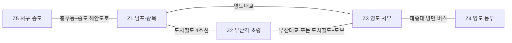
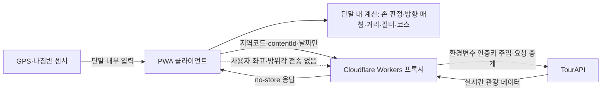

# Spindle 기능설명서

> **2026 관광데이터 활용 공모전 — 웹·앱 개발 부문**
> 서비스명: Spindle · 개발: 이진우(1인) · 작성 기준일: 2026-08-02
> **서비스 URL: https://spindle-6vp.pages.dev** (설치 없이 모바일 브라우저에서 바로 실행되는 PWA)
> 제출물: 서비스 URL + 본 기능설명서 + TourAPI 운영계정 정보

---

## 심사 기준 대응 요약

| 심사 항목 | 배점 | Spindle의 대응 | 본문 |
|---|---:|---|---|
| 기획력 | 30 | 대표 관광지 쏠림이라는 실재 문제를, 방향 스핀이라는 게임 경험과 분산 가중치로 동시에 푸는 구조 | 1·4장 |
| 완성도 | 30 | 센서가 필요한 현장 모드와 어디서나 되는 여행 모드, 모든 실패 경로의 폴백, 결과·공유·코스까지 끊기지 않는 흐름 | 3장 |
| 데이터 활용 적절성 | 20 | TourAPI **두 개 서비스**(KorService2 + 관광지 집중률 예측)를 핵심 동선에서 실시간 호출 | 5장 |
| 발전성 | 20 | 존-교량 모델의 타 지역 템플릿화와 RTO 협업형 분산 지표 로드맵 | 8장 |
| 지역특화 | +2 | 부산 중구·동구·서구·영도구의 지형·교량·생활권을 알고리즘 데이터로 모델링 | 4.2장 |

---

## 1. 서비스 개요

Spindle은 여행 중 반복되는 "다음엔 어디 가지?"라는 선택 피로를, **휴대폰을 돌려 방향을 정하는** 스핀 경험으로 바꾸는 관광 분산형 게임 탐색 PWA다.

그러나 목적은 룰렛을 하나 더 만드는 데 있지 않다. **해운대·광안리 같은 대표 관광지에 집중된 방문 수요를 부산 원도심과 영도의 골목·시장·근현대 문화유산으로 흘려보내는 것**이 서비스의 핵심이다.

스핀은 사용자가 이동할 방향을 즐겁게 결정하게 하고, 추천 엔진은 그 방향 안에서 실제 접근 가능성, 운영 상태, 관광지 인지도를 함께 평가한다. 덜 알려진 장소에는 더 높은 분산 가중치를 주되, 접근하기 어렵거나 운영하지 않는 곳은 제외한다. **우연성은 여행의 시작을 가볍게 만들고, 지역 데이터는 결과의 품질을 지킨다.**

한국관광 데이터랩에 게시된 2021년 부산 방문객 2,000명 조사에서 "가장 기억에 남는 지역" 응답은 해운대해수욕장 58.4%, 광안리 31.7%, 자갈치시장 31.5% 순이었다. 부산 관광 기억이 소수 대표지에 강하게 형성돼 있음을 보여주는 기준선이다. ([한국관광 데이터랩, 2022-05-09 게시](https://datalab.visitkorea.or.kr/site/portal/ex/bbs/View.do?bcIdx=300885&cbIdx=1126&pageIndex=1))

### 왜 "방향"인가

무작위 추천은 이미 많다. Spindle이 거리나 카테고리가 아니라 **방향**을 축으로 삼은 이유는 세 가지다.

1. **몸의 행동이 결과를 만든다.** 휴대폰을 실제로 돌려 겨눈 방위가 그대로 알고리즘 입력이 된다. 연출 각도와 계산 각도가 분리돼 있지 않다.
2. **방향은 분산의 자연스러운 단위다.** 사용자가 늘 가던 쪽이 아닌 방위를 뽑으면, 설득이나 계몽 없이도 동선이 흩어진다.
3. **부산 원도심에서는 방향이 곧 지형이다.** 같은 500m라도 영도대교를 건너느냐 산복도로를 오르느냐에 따라 경험이 완전히 달라진다. 4.2장의 존-교량 모델이 이 차이를 계산한다.

---

## 2. 대상 지역과 범위 구체화 경위

서비스 범위는 **부산 중구·동구·서구·영도구**다. 남포·광복, 부산역·초량, 영도 서부·동부, 서구·송도를 하나의 도보·대중교통 탐색권으로 연결한다. 바다, 산복도로, 영도대교·부산대교 같은 물리적 조건 때문에 직선상으로 가까워 보여도 실제 이동은 크게 우회할 수 있다는 점을 추천 알고리즘에 반영한다.

해운대·수영권이 현재 범위에 없는 것은 데이터 누락이 아니라 **의도적 선택**이다. 대표 관광지에 집중된 수요를 원도심·영도로 분산하는 효과를 먼저 검증하기 위해 이 네 개 구에 집중했다.

> 초기 전국형 기획을 검토한 결과 추천 품질과 지역 관광분산 효과를 높이기 위해 부산 특화형으로 구체화했으며, 핵심 서비스 구조는 유지하였다.

| 최초 제안서 기능 | 현재 반영 | 구체화 내용 |
|---|---|---|
| 자이로·나침반 기반 8방위 가챠 | 유지 | 현장 모드의 실제 기기 회전, 여행 모드의 원판 스핀 |
| 위치·방향 기반 관광지 추천 | 유지 | 부산 원도심·영도권에 집중, 모든 위치 계산은 단말에서 수행 |
| 거리 다이얼 | 스케일 조정 | 부산 생활권에 맞는 20분~하루 이동시간 다이얼로 변경 |
| 8방위 큐레이션 메시지 | 유지 | 스핀 결과 방위마다 부산 탐색을 유도하는 메시지 |
| 공유 카드 자동 생성 | 이미지 카드로 유지 | 1080×1920 PNG 생성·공유·저장 |
| 다녀온 곳 컬렉션 | 부산 동네 도장깨기로 구체화 | 방문 판정은 단말에서, 관광지 응답은 영속 저장하지 않음 |
| 사전 캐싱 자체 DB | **실시간 호출로 재설계** | 규정 준수를 위해 지역코드 기반 실시간 호출 + 세션 메모리만 사용 |
| 낮은 인지도 관광지 가산점 | 유지 | T1~T3 인기도 티어의 역가중으로 관광 분산 유도 |

부산 특화 전환과 지역특화 가점 인정 여부는 **공모전 사무국 회신으로 확인(2026-07-31)** 했다. 본 서비스는 초기 제안의 핵심 구조를 유지하면서 지역의 물리적 특성이 알고리즘을 바꾸는 구체화 사례이며, 지역특화 가점 대상이다.

---

## 3. 핵심 기능

### 3.1 두 가지 이용 모드

| 모드 | 방향 입력 · 출발점 | 사용 상황 |
|---|---|---|
| **현장 모드** | 실제 기기 방위(DeviceOrientation)로 원판이 회전하고, GPS 1회 취득 위치가 출발점 | 부산 현장에서 휴대폰을 실제로 돌려 즉흥적으로 다음 장소를 찾을 때 |
| **여행 모드** | 원판 드래그·`돌리기` 버튼, 부산역·남포동·영도 프리셋 출발점 | 여행 전 계획, 또는 부산 밖에서 URL만으로 서비스를 확인할 때 |

**여행 모드는 심사위원이 서울에서 URL만 열어도 모든 기능을 완주할 수 있는 공식 경로다.** 센서 권한이 없거나 거부됐거나 부산 권역 밖이면, 빈 화면 대신 사유 한 줄과 함께 여행 모드로 자연스럽게 이어진다.

현장 모드의 방위 확정은 두 경로가 같은 값을 쓴다. 겨눈 채 방위가 안정되면 자동으로 잠기고(켜자마자 잠기지 않도록 약 2.5초 조준 유예), `이 방향으로 결정` 버튼으로 즉시 확정할 수도 있다. 화면만 추가로 도는 가짜 관성은 쓰지 않는다.

### 3.2 핵심 이용 흐름

1. 현장 모드(나침반)를 켜거나 여행 모드 출발점을 고른다.
2. 이동시간 다이얼을 20분부터 하루까지 조절한다.
3. 휴대폰을 실제로 돌리거나 원판을 스핀한다.
4. 확정 각도를 동·서·남·북·북동·북서·남동·남서의 8방위로 분류한다.
5. 방향과 이동시간 안에서 추천 점수가 높은 세 후보를 만들고 가중 랜덤으로 한 곳을 제시한다. 후보가 없으면 인접 방위로 확장하고 그 이유를 알려준다.
6. 결과 카드에서 TourAPI 이미지·소개·도보 예상 시간과 이용시간·휴무·요금·주차 등 방문정보, 지도 길찾기를 확인한다.
7. 결과를 인스타그램 스토리 비율의 공유 카드로 만들어 공유하거나 저장한다.

### 3.3 확장 기능

| 기능 | 구현 내용 |
|---|---|
| **명소 둘러보기 · 혼잡 예측** | 카카오맵 위에 관광지 핀을 띄우고, **관광지 집중률 예측 API**의 당일 예상 집중률을 반영해 높은 곳은 `오늘 혼잡 예상`, 낮은 곳은 `오늘 가기 좋아요`로 표시한다. 분산이라는 서비스 목적을 데이터로 직접 뒷받침하는 화면이다. |
| **방향 기반 여행 코스** | 첫 추천과 스핀 방위를 유지한 채 이동시간 예산 안에서 2~4개 장소를 연결한다. 후보·순서·이동비용은 단말에서 계산한다. |
| **테마 덱** | 바다, 골목·시장, 근현대·역사, 야간, 먹거리 중 하나를 골라 우연성에 취향을 더한다. |
| **축제 특별 카드** | `searchFestival2`의 개최 기간과 스핀 방향이 맞을 때만 일반 추천 위에 "오늘 열리는 행사"를 표시한다. 축제가 없어도 일반 추천은 정상 동작한다. |
| **부산 동네 도장깨기** | 길찾기·도착 확인 같은 방문 의사 행동을 계기로 4개 구의 수집 현황을 단말에서 보여준다. 로그인·개인정보 수집은 없다. |

### 3.4 코스 안내 — 단계는 앱이, 길찾기는 카카오맵이

방향 코스가 만들어지면 `코스 안내 시작` 버튼으로 화면 이동 없이 2단계 안내가 열린다.

| 단계 | 내용 | 전환 조건 |
|---|---|---|
| 1단계 | 1번 장소까지 카카오맵 길찾기 | 사용자가 `도착했어요`를 누름 |
| 2단계 | 1→2→3→4 방문 순서 전체 코스 보기 | — |

**Spindle은 경로를 계산하지 않는다.** 실제 도보 경로 탐색·재탐색·도착 판정·턴바이턴 안내는 모두 카카오맵이 담당하고, 앱은 "지금 어느 단계인지"만 관리한다. 이 선택의 규정적 근거는 7.1장에 정리했다.

---

## 4. 추천 알고리즘

### 4.1 점수 구조

> 후보 점수 = **방향 일치도 × 접근 가능성 × 운영 상태 × 분산 가중치**

| 요소 | 판단 방식 | 역할 |
|---|---|---|
| 방향 일치도 | 45° 너비 8방위 부채꼴 포함 여부와 중심선 근접도를 단말에서 계산 | 스핀으로 정한 방향을 결과에 일관되게 반영 |
| 접근 가능성 | 같은 존은 직선거리×1.3, 다른 존은 교량·지하철·버스 경유 비용으로 보정 | 바다 건너 직선거리처럼 실제로 갈 수 없는 추천 방지 |
| 운영 상태 | `detailIntro2`의 이용시간·휴무를 **도착 예상 시각 기준으로** 판정, 축제는 개최 기간 필터 | 당장 방문 가능한 결과를 우선 |
| 분산 가중치 | 대표 관광지는 낮추고 숨은 명소는 높이는 T1~T3 역가중 | 인기 장소 재쏠림을 줄이고 골목·시장·유산 발견 확대 |

**무작위인 것은 스핀의 방향과 상위 후보 중 최종 선택뿐이다.** 후보군 자체는 접근 가능성·운영 상태·분산 목적을 통과한 장소로 제한된다.

운영 상태는 "지금 출발하면 문을 닫기 전에 도착하는가"로 본다. 오늘 휴무이거나 도착이 마감 이후면 후보에서 빼고, 머무를 시간이 30분도 남지 않으면 감점해 뒤로 민다. 결과 카드에는 `오늘 18:00 마감 · 지금 출발해도 여유 있어요`처럼 한 줄로 알린다.

도착 시각의 근거는 **존-교량 모델의 보정 이동시간**이다. 경로 API로 실제 도로 경로를 받으려면 사용자의 현재 좌표를 외부 서버로 보내야 하므로(5장) 쓰지 않았고, 대신 모델이 세지 않는 비용(신호·경사·계단·환승 대기)을 감안한 **안전 마진 10분**을 더해 보수적으로 판정한다. 그래서 분 단위 도착 시각을 단정하지 않는다 — 마감 시각은 공공데이터 값이라 그대로 적고, 도착은 "지금 출발하면"이라는 추정 표현으로 구분한다. 이용시간이 하절기·동절기로 나뉘어 있어 오늘 어느 쪽인지 알 수 없는 경우처럼 **판단이 모호하면 감점하지 않고 통과시킨다.**

### 4.2 존-교량 모델 — 부산의 지리가 추천을 바꾸는 방식

일반적인 반경 검색은 바다를 가로지르는 직선거리도 "가깝다"고 판단한다. Spindle은 대상지를 다섯 개 생활권 존으로 나누고, 존을 건널 때 실제 교량·지하철·버스 경유 비용을 반영한다.

> 존 연결 관계를 설명하는 개념도이며 실제 축척이나 정밀 경로가 아니다.

| 존 | 이름 | 포함 지역 |
|---|---|---|
| Z1 | 남포·광복 | 남포동, 광복동, 자갈치, 국제시장, 부평동, 민주공원 |
| Z2 | 부산역·초량 | 부산역, 초량 이바구길, 차이나타운, 좌천동·범일동 부산진시장까지의 산복도로 축 |
| Z3 | 영도 서부 | 영도대교·부산대교 남단, 봉래·대평·남항동, 깡깡이마을, 흰여울문화마을 |
| Z4 | 영도 동부 | 신선동 동측, 중리, 동삼동, 태종대 방면 |
| Z5 | 서구·송도 | 아미동 비석문화마을, 남부민동, 송도해수욕장, 암남공원 |

| 구간 | 실제 경유 | 보정 방식 |
|---|---|---|
| 같은 존 | 원도심 골목·보행로 | 직선거리 × 도보 우회계수 1.3, 분속 67m로 시간 환산 |
| Z1 ↔ Z3 | 영도대교 | 출발지→북단, 다리 약 214m와 접속로, 남단→목적지 합산(다리 도보 약 5분) |
| Z1 ↔ Z2 | 도시철도 1호선 남포→중앙→부산역 | 양쪽 역 접근 도보 + 탑승 10분 근사 |
| Z2 ↔ Z3 | 부산대교 또는 도시철도+영도대교 도보 | 두 경로를 모두 계산해 짧은 쪽 채택 |
| Z3 ↔ Z4 | 태종대 방면 버스 | 영선동 태종로변→태종대 종점 구간 대중교통 25분 근사 |
| Z1 ↔ Z5 | 충무동~송도 해안도로 | 도보 약 2.7km·35분 또는 시내버스 약 10~15분 근사 |
| Z2↔Z4, Z2↔Z5, Z4↔Z5 | 다른 존을 경유하는 장거리 구간 | 이동시간 다이얼이 `하루`일 때만 후보 허용 |

이동시간 다이얼 상한을 넘는 후보는 제외한다. 이 모델은 정밀 길찾기가 아니라 **부산 지형을 반영한 접근성 근사치**이며, 화면에서도 실제 경로와 다를 수 있음을 안내하고 장소별 지도 길찾기를 함께 제공한다.

### 4.3 인기도 티어와 분산 가중치

35개 대표 POI를 TourAPI `contentId` 기준으로 수동 큐레이션했다. 관광지명·주소·좌표·소개·이미지 같은 **TourAPI 원본 응답은 파일에 저장하지 않으며**, 티어·존·테마 같은 추천용 메타데이터만 관리한다. 큐레이션에 없는 POI는 기본 T2로 처리한다.

| 티어 | 정의 | 분산 가중치 | 큐레이션 수 | 대표 예시 |
|---|---|---:|---:|---|
| T1 | 검색량·SNS 노출이 큰 대표 관광지 | ×0.5 | 8 | 국제시장, 자갈치시장, 부산타워, 송도해수욕장 |
| T2 | 알려졌지만 과도한 쏠림이 없는 곳 | ×1.0 | 9 | 부산근현대역사관, 절영해안산책로, 태종사 |
| T3 | 골목·시장·근현대 유산 중심의 숨은 명소 | ×1.6 | 18 | 민주공원, 미술의거리, 남선창고터, 깡깡이 예술마을 |

| 존 | T1/T2/T3 | 분산 설계의 역할 |
|---|---:|---|
| Z1 남포·광복 | 5/4/3 | 대표 시장권의 T1 비중을 낮추고 골목·근현대 후보로 분산 |
| Z2 부산역·초량 | 0/1/6 | 산복도로와 근현대 유산을 강한 분산 후보로 구성 |
| Z3 영도 서부 | 1/2/3 | 흰여울 대표지에서 산업유산·시장·산책로로 분산 |
| Z4 영도 동부 | 0/1/3 | 태종대권의 역사·자연·전망 후보 발굴 |
| Z5 서구·송도 | 2/1/3 | 해수욕장·케이블카에서 해안길·지질·전망대로 분산 |

티어는 계산에만 쓰고 결과 카드에 "숨은 명소" 배지로 노출하지 않는다. 사용자가 인기 장소를 배제당한다고 느끼지 않게 하면서도, 동일 조건에서 **T3는 T1보다 3.2배 높은 분산 가중치**를 갖는다.

---

## 5. TourAPI 활용 내역

Spindle은 한국관광공사 **두 개 오픈 API 서비스**를 실시간 호출한다.

### 5.1 국문 관광정보 서비스 (KorService2)

| 엔드포인트 | 용도 | 반영 시점 |
|---|---|---|
| `areaCode2` | 부산과 중구·동구·서구·영도구 지역코드 확인 | 설정 검증 |
| `areaBasedList2` | 대상 4개 구의 관광 POI 목록 | 세션 시작·후보 구성 |
| `detailCommon2` | 관광지명, 주소, 개요, 대표 이미지 | 결과 카드·코스 상세 |
| `detailIntro2` | 이용시간, 휴무, 체험, 요금, 주차 등 | 방문 정보와 운영 상태 판단 |
| `detailImage2` | 대표 이미지가 부족한 장소의 추가 이미지 | 결과 카드·공유 카드 |
| `searchFestival2` | 지역·날짜 기준 축제·행사 | 조건부 축제 특별 카드 |

### 5.2 관광지 집중률 예측 서비스

| 엔드포인트 | 용도 | 반영 시점 |
|---|---|---|
| `tatsCnctrRatedList` | 부산 법정구역(26110 중구 / 26140 서구 / 26170 동구 / 26200 영도구)의 당일 관광지 예상 집중률 | 명소 둘러보기 지도의 혼잡·쾌적 표시 |

집중률은 예상 집중률 70 이상이면 `오늘 혼잡 예상`, 40 이하면 `오늘 가기 좋아요`로 표시한다. **관광 분산이라는 서비스 목적을 사용자가 눈으로 확인하는 지점**이며, 추천 점수에는 반영하지 않아 우연성과 분산 논리를 흐리지 않는다.

### 5.3 데이터 취급 원칙

- **사용자 GPS 좌표 없이 지역코드 기반 `areaBasedList2`만 사용한다.** 좌표 기반 `locationBasedList2`는 의도적으로 사용하지 않는다.
- TourAPI 응답은 로컬 DB, 파일, localStorage, IndexedDB, service worker Cache Storage에 **적재하지 않는다.** 현재 세션 메모리 범위에서만 사용한다.
- service worker의 API 경로는 network-only이며, 오프라인에서는 앱 셸과 "네트워크 필요" 안내만 제공한다.
- 인증키는 프록시 환경변수에만 저장한다.
- **2026-07-08 운영계정 키로 실호출을 확인**한 뒤 개발 기간 내내 해당 운영계정 호출 이력을 축적하고 있다. 2026-07-31부터 프로덕션 프록시에서도 운영계정 키를 사용한다.
- 도장깨기는 방문한 `contentId`만 단말에 저장하며, 장소명·주소·좌표·소개·이미지 등 원본 응답은 저장하지 않는다.

---

## 6. 아키텍처 — 좌표 무전송

Spindle의 설계 원칙 중 첫 번째는 **사용자의 GPS 좌표와 기기 방위각을 어떤 서버로도 전송하지 않는다**는 것이다.

- 방향 매칭, 존 판정, 거리 계산, 이동시간 보정, 코스 구성, 도착 판정 — **위치와 관련된 모든 계산이 단말 안에서 끝난다.**
- 프록시는 인증키 보호와 요청 중계만 담당한다. 지역코드, 관광지 `contentId`, 날짜 같은 **비개인 파라미터만** 받고 GPS 좌표·선택 출발점 좌표·방위각·생성된 코스 배열은 받지 않는다. 로그에도 남기지 않는다.
- 지도는 브라우저와 카카오맵이 직접 통신하며, 카카오맵 길찾기 링크에는 **공개 관광지의 이름·좌표·방문 순서만** 담는다. 사용자 현재 위치는 링크가 열린 뒤 카카오맵이 자체 권한으로 정한다.
- 이 구조는 선언이 아니라 **자동 검사로 강제**한다. 금지 패턴 스캐너(`locationBasedList2`, 클라이언트 내 인증키·좌표 파라미터)가 커밋마다 실행되고, 네트워크 요청 URL에 좌표가 섞이지 않음을 단위 테스트로 고정한다.

공모전 공식 FAQ는 *"개인위치정보를 단말기 내부에서만 활용하고 사업자 서버로 전송하지 않으면 위치기반서비스사업 신고 대상에서 제외되며, 서버로 전송하면 DB 저장 여부와 관계없이 신고 대상"* 이라고 안내한다. **Spindle은 좌표와 방위각을 단말 밖으로 보내지 않는 구조이므로 이 비신고 기준에 해당한다.**

또한 계정·로그인·이메일·전화번호를 수집하지 않는다. 수집하지 않은 정보는 유출될 수 없다.

---

## 7. 규정 준수를 위한 설계 결정

기능을 더하는 것보다 **덜어내는 판단**이 서비스 성격을 결정한 지점이 세 곳 있다. 모두 의도적 선택이며, 그 결과를 아래에 명시한다.

### 7.1 앱 내 턴바이턴 내비게이션을 제공하지 않는다

코스 안내를 앱이 직접 하려면 실제 도로 경로가 필요하고, 경로를 받으려면 **사용자의 현재 좌표를 라우팅 API의 출발지로 전송**해야 한다. 이는 6장의 좌표 무전송 원칙을 정면으로 깨고, FAQ 기준상 위치기반서비스사업자 신고 대상으로 전환된다. (Kakao Maps JS SDK에는 경로 탐색 기능이 없고, 카카오모빌리티 길찾기는 REST 키가 필요한 별도 서버 API여서 클라이언트 직접 호출로도 우회할 수 없다.)

그래서 Spindle은 **길찾기를 카카오맵에 위임하고 단계 관리만 담당한다**(3.4장). 그 결과 코스 흐름에서 `watchPosition`·DeviceOrientation을 전혀 사용하지 않으며, 사용자는 카카오맵 수준의 실제 도보 안내를 그대로 받는다. 안내 품질을 낮추지 않으면서 규정 리스크를 0으로 만드는 선택이다.

### 7.2 좌표 기반 `locationBasedList2`를 사용하지 않는다

좌표로 주변 POI를 조회하는 방식이 구현은 더 간단하지만, 사용자의 실제 위치를 외부로 보내야 한다. Spindle은 **지역코드 기반 `areaBasedList2`로 4개 구 후보를 받아 단말에서 방향·거리·존을 계산**한다. 후보 풀이 지역 단위로 고정되기 때문에, 좌표를 보내지 않고도 같은 품질의 방향 추천이 가능하다.

### 7.3 TourAPI 응답을 저장하지 않는다

사전 캐싱 자체 DB는 최초 제안서의 계획이었으나, 실시간 호출만 인정하는 공모전 규정에 맞춰 **전면 재설계**했다. 응답은 세션 메모리에서만 재사용하고 앱을 닫으면 사라진다. 성능은 세션 내 중복 호출 제거(디듀프)와 결과 카드 진입 전 프리페치로 보완했다.

---

## 8. 발전성

### 8.1 존-교량 모델의 타 지역 템플릿화

추천 엔진과 지역 데이터가 분리돼 있어, 도시별로 **세 가지 데이터만 교체**하면 같은 구조를 확장할 수 있다.

1. 생활권 존 다각형
2. 교량·지하철·버스 등 존 간 연결 비용
3. 지역 POI의 인기도 티어와 테마 메타데이터

부산 안에서의 1단계 확장은 **해운대·수영권을 Z6·Z7로 추가**하는 것이다. 쏠림의 진원지에서 스핀해도 원도심으로 흘려보내는 구조가 서비스 논리의 완성형이다. 이 확장도 엔진을 다시 만드는 작업이 아니라 위 세 가지를 같은 템플릿에 추가하는 방식이다.

대전·광주 동구처럼 원도심과 생활권 단절이 공존하는 도시에도 같은 방식으로 적용할 수 있다. **부산은 단순한 지역 필터가 아니라 재사용 가능한 지역 접근성 모델의 첫 템플릿이다.**

### 8.2 RTO 협업 모델과 분산 유도 지표

지역관광공사와 협업할 때는 "대표지 노출을 줄였다"는 선언보다 **측정 가능한 지표**가 필요하다. 향후 규정 검토를 거쳐 다음 집계를 제공할 수 있다.

- T1 대비 T2·T3 추천 및 선택 비율
- 존별 추천 분포와 분산도
- 대표 관광지에서 인접 골목·시장·유산으로 이어진 코스 선택 비율
- 축제 특별 카드 노출 후 일반 추천 동선 유지율
- 집중률 예측이 높은 날 해당 관광지의 추천 회피율

지표를 도입하더라도 **사용자 좌표·방위각·개인 식별자는 수집하지 않는다.** 익명 카운터도 좌표 무전송 원칙과 공모전 규정을 재확인한 뒤에만 추진한다.

### 8.3 기능 확장 백로그

| 단계 | 확장 기능 | 기대 효과 |
|---|---|---|
| 1 | 계절·시간대 가중치 | 야간·우천·계절 운영조건에 맞는 추천 품질 향상 |
| 2 | 동반자 유형 필터 | 혼자·가족·친구 등 여행 맥락별 후보 최적화 |
| 3 | 반려동물 모드 | 동반 가능 시설과 야외 동선 반영 |
| 4 | 다국어 인바운드 | 원도심·영도의 덜 알려진 장소를 외국인 여행자에게 연결 |
| 5 | 다지역·RTO 협업 | 지역 데이터 템플릿과 분산 지표 기반 도시별 운영 모델 |

---

## 9. 규정 준수 요약

| 원칙 | 적용 내용 |
|---|---|
| TourAPI 실시간 호출만 사용 | 모든 관광 콘텐츠를 운영계정 키로 실시간 조회 |
| 로컬 DB·파일 데이터 미사용 | 원본 응답이나 이를 대체하는 관광정보 DB·파일 없음, 세션 메모리만 사용 |
| 영속 캐시 금지 | localStorage·IndexedDB·Cache Storage·서버 DB에 API 응답 미저장 |
| 출처 텍스트 표기 | 공공데이터 사용 화면·공유 카드·본 문서에 `출처: ⓒ한국관광공사` 표시 |
| 운영 주체 구분 | 공식 CI/BI 로고 미사용, 기관명을 서비스명·브랜딩에 미사용 |
| 비로그인·개인정보 미수집 | 계정·이메일·전화번호 수집 기능 없음 |
| 좌표·방위각 무전송 | 위치 계산 전부 단말 내 수행, 프록시·로그·외부 링크에 좌표 미포함 |
| 인증키 보호 | Cloudflare Workers 환경변수에만 보관, 클라이언트·저장소에 미포함 |

---

## 기술 구성

| 영역 | 내용 |
|---|---|
| 프론트엔드 | React + TypeScript (Vite), PWA (manifest + service worker 오프라인 셸) |
| 프록시 | Cloudflare Workers — 인증키 주입·요청 중계만, 로그 미저장 |
| 배포 | Cloudflare Pages (https://spindle-6vp.pages.dev) |
| 지도 | 카카오맵 JS SDK 베이스맵 + 자체 오버레이 핀, 실패 시 내장 벡터 지도 폴백. 길찾기는 카카오맵·네이버지도 딥링크 |
| 품질 관리 | 금지 패턴 스캐너 + 타입체크 + 린트 + 단위 테스트를 커밋마다 자동 실행 |

---

## 제출 전 확인 항목

- [ ] **데이터랩**: 최신 연도의 부산 관광지 방문 집중 수치로 1장 기준선(2021년)을 보강하고 조회 기간·지표 정의·원문 URL을 함께 기록
- [ ] **화면 캡처**: 프로덕션 최종 화면 캡처와 각 캡처의 기능 번호·심사 항목 설명 배치
- [ ] **실기기 검증**: iOS Safari·Android Chrome의 현장 모드 나침반 추종·권한 거부 폴백, 모바일 공유·저장, 시크릿 창 여행 모드 완주 (현장 모드는 2026-08-02 재배선했으므로 재검증 필요)
- [ ] **코스 안내**: 모바일 카카오맵(앱·모바일웹)과 PC 웹에서 1단계·2단계 링크가 정상 동작하고, 팝업 차단·앱 미설치 시 장소별 길찾기로 계속 진행 가능한지 확인
- [ ] **존 데이터**: 존 다각형, 아미동 비석문화마을 좌표, 영도대교·부산대교 접속점, Z3↔Z4·Z1↔Z5 버스 근사를 실제 지도에서 재확인 (버스 노선번호는 확인 전까지 문서에 명시하지 않음)
- [ ] **제출 양식**: 최종 양식의 서비스 URL·버전·작성자·운영계정 정보 입력란 작성 (인증키 자체는 본문·저장소에 미기재)
- [ ] **다이어그램**: 제출 양식이 마크다운을 렌더링하지 않으면 4.2장·6장 mermaid 도식을 이미지로 변환해 삽입

---

출처: ⓒ한국관광공사
